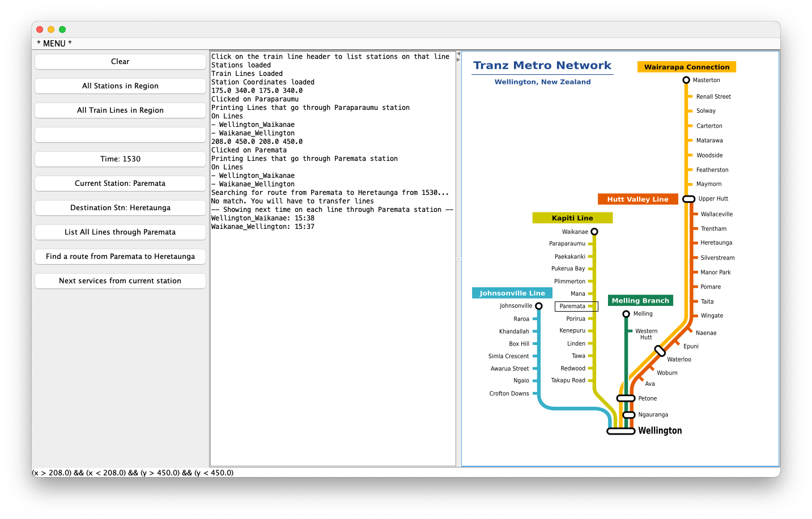

# WellyTrains

Assignment for MSwDev - September 2023.

App to visualise the Wellington train network and practice using the HashMap data structure to represent Train Lines, Station, Services etc.
It uses the Victoria University of Wellington ECS100 library to display the network in a window.

(Train data is not real)

## Usage

Run the program from your IDE. The program will load the train network from the `data` folder and display it in a window.

## Installation

There should be no installation required.

## Contributing

Pull requests are welcome. For major changes, please open an issue first to discuss what you would like to change.
